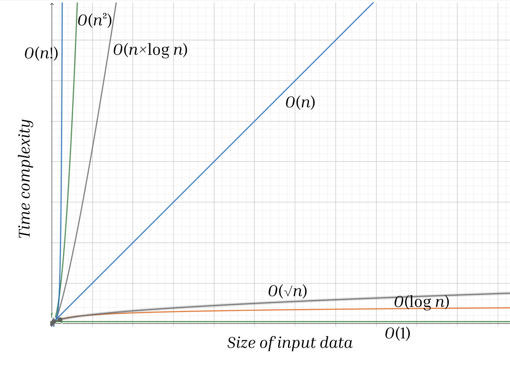

<script type="text/javascript" id="MathJax-script" async
  src="https://cdn.jsdelivr.net/npm/mathjax@3/es5/tex-mml-chtml.js">
</script>

<script>
  MathJax = {
    tex: {
      inlineMath: [['$', '$']]
    }
  };
</script>

### [Алгоритмы](README.md) / Оценка сложности алгоритмов

# **Оценка сложности алгоритмов** 

Чтобы выполнить какой-либо алгоритм, компьютеру необходимо проделать определенное количество операций, и это количество ограничено. Оптимальное время работы алгоритма для любых входных данных на олимпиадах – $1$ секунда. Компьютер способен выполнить ограниченное количество операций за секунду (Python позволяет произвести примерно $10^6$ операций в секунду), это значит, что необходимо понимать, впишется ли ваше решение в ограничение по времени или нет.

Для того, чтобы оценивать сложность алгоритма, нам нужно познакомиться с таким понятием, как *асимптотика*. Асимптотика пришла в информатику из математики, где с помощью нее описывается поведение функций. В информатике так оценивается асимптотическая сложность алгоритмов, так как алгоритмы - это все те же функции.

Введем такое понятие, как *$O$-большое*. Говорят, что функция $f(n)$ является $O(g(n))$ (читается: $O$-большое от $g(n)$), если существует такая константа (постоянное значение) $C$, что для всякого $n$ $f(n) \leq Cg(n)$. 

В случае с алгоритмами мы рассматриваем в качестве возрастающей функции $g(n)$ входные данные, стремящиеся к бесконечности, соответственно, $f(n)$ – асимтотическая сложность нашего алгоритма. 

Рассмотрим программу:

```py
    n = int(input())
    print(n + 1)
```

Очевидно, что такая программа будет работать быстро, вне зависимости от входных данных она будет выполняться за одно и то же количество операций. В таких случаях говорят, что программа работает *за константу*, а ее асимптотическая сложность – $O(1)$.

Но чаще всего сложность алгоритма напрямую зависит от входных данных. Например, в данной программе:

```py
    n = int(input())
    for i in range(1, n + 1):
        someActions.here()
```

цикл повторяется $n$ раз, соответственно, сложность ее работы – $O(n)$. Алгоритмы, сложность которых составляет $O(n)$, называются *линейными*.

Если мы встречаем двойной цикл:

```py
    n = int(input())
    for i in range(n):
        for j in range(n):
          someActions.here()
```
            
то внутренний цикл повторяется $n$ раз по $n$. Таким образом, алгоритм работает за $O(n^2)$, его сложность *квадратичная*.

Ниже показан график зависимости времени выполнения от размера входных данных:



Мы видим, что медленнее всего растет сложность алгоритмов, работающих за логарифм ($O(\log n)$), например, бинарного поиска, и константу($O(1)$). Быстрее растет $O(\sqrt{n})$, такую сложность имеет, например, алгоритм проверки чисел на простоту. Еще быстрее растет сложность линейных алгоритмов, такие применяются для работы с массивами. Есть алгоритмы еще медленнее, например, $O(n \times \log n)$ (быстрая сортировка и сортировка слиянием), $O(n^2)$ (например, работа с двойными массивами), и одни из самых медленных – $O(n!)$ (проверка всех перестановок).

Каждый раз при написании решения какой-либо задачи стоит задумываться над его асимптотической сложностью и обращать внимание на ограничения входных данных. Например, если входные данные могут возрастать до $10^9$, скорее всего, задача решается математически или применяются алгоритмы с логарифмической сложностью. А если входные данные могут быть не больше, чем $10^6$, то, скорее всего, стоит применить линейный алгоритм.
