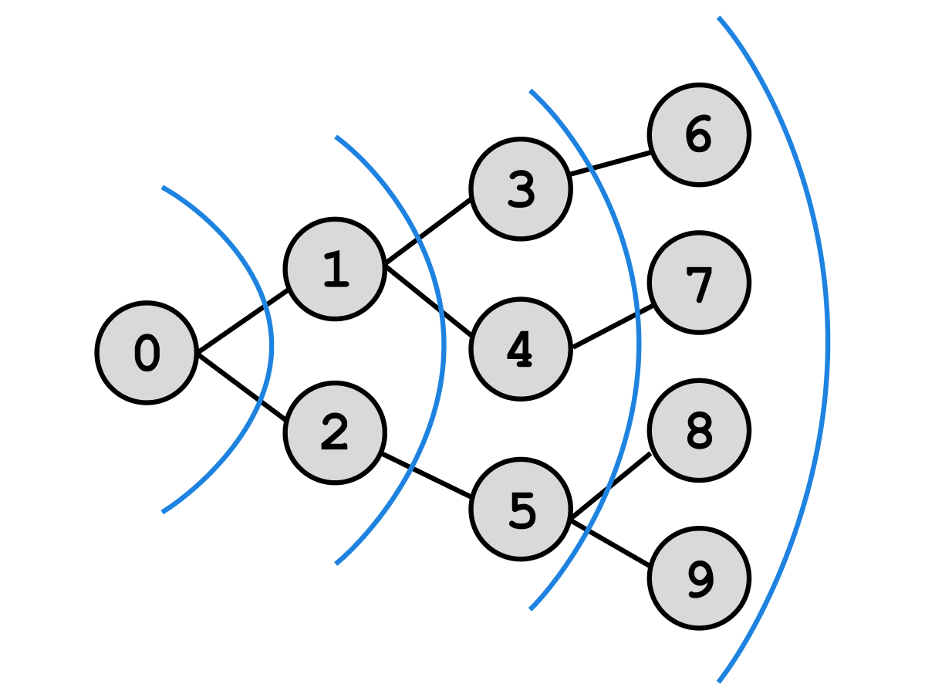

### [Алгоритмы](README.md) / Графы: Поиск в ширину

# **Поиск в ширину**

Мы уже упоминали об одном алгоритме поиска – бинарном поиске. Бинарный поиск это поиск по массиву, сейчас же мы рассмотрим *поиск по графу*.

Поиск в ширину начинается с заданной вершины и обрабатывает всех ее соседей, потом обрабатываются соседи соседей и так далее. Этот алгоритм можно сравнить с волной, которая проходит по всему графу и захватывает сперва соседей первого уровня, потом второго, третьего и так далее.

## **Реализация**

Представим, что вы хотите узнать, можете ли вы быть знакомы с президентом через какое-либо количество рукопожатий. Разумно предположить, что сперва можно осмотреть ваших друзей во ВКонтакте (ну а вдруг!), потом рассматривать друзей ваших друзей, и так далее, пока в списке друзей пользователя мы не найдем президента.

Для решения задачи представим граф, который описывает ваши связи в ВК, где `‘you’` – это вы, а `‘President’` – президент. Граф представим в виде списка смежности, но так как вершины теперь не числа, а строки (имена пользователей), список придется модифицировать. Пусть это будет словарь:

    graph = {
        'you': ['Cringe993', 'ur_mom', 'rickRoll'],
        'ur_mom': ['you', 'rickRoll', 'MARYGOLD', 'Amadevs'],
        'rickRoll': ['you', 'Amadevs', 'ur_mom'],
        'Cringe993': ['you'],
        'MARYGOLD': ['ur_mom', 'Amadevs', 'President'],
        'Amadevs': ['MARYGOLD', 'rickRoll', 'ur_mom'],
        'President': ['MARYGOLD']
    }

Используя имя пользователя как ключ, можно обращаться к списку друзей этого пользователя.

Также внутри функции надо завести очередь пользователей, ожидающих обработки. Нам нужна именно очередь `queue`, чтобы мы извлекали первый элемент, так как алгоритм обрабатывает вершины по порядку.

Еще заведем множество `used` для уже обработанных пользователей, чтобы мы не обрабатывали пользователя по второму разу.

Приступим к написанию кода:

    def bfs(username):
        queue = deque(graph[username])
        used = set()
        
        while len(queue) > 0:
            person = queue.popleft()
            if not person in used:
                if person == 'President':
                    return True
                else:
                    queue += graph[person]
                    used.add(person)
        
        return False

Мы будем обрабатывать пользователей, пока они еще будут в очереди на обработку. Если очередь пуста, это значит что бы обошли все вершины графа.

Мы извлекаем первый элемент из очереди. Потом смотрим, обработали ли мы пользователя раньше. Если да, то цикл переходит на следующую итерацию. Если пользователь не обработан, то мы проверяем, является ли пользователь президентом, если да, то алгоритм прерывается и функция возвращает `True`, иначе в список обработки добавляются его друзья и пользователь добавляется во множество обработанных. Если во всем графе не найдется президента, то функция вернет `False`.

Так как этот алгоритм проходит проходит через все ребра и хранит в памяти все вершины графа, то сложность работы этого алгоритма составляет *O*$(V + E)$, где $V$ – количество вершин в графе, а $E$ – количество ребер.
