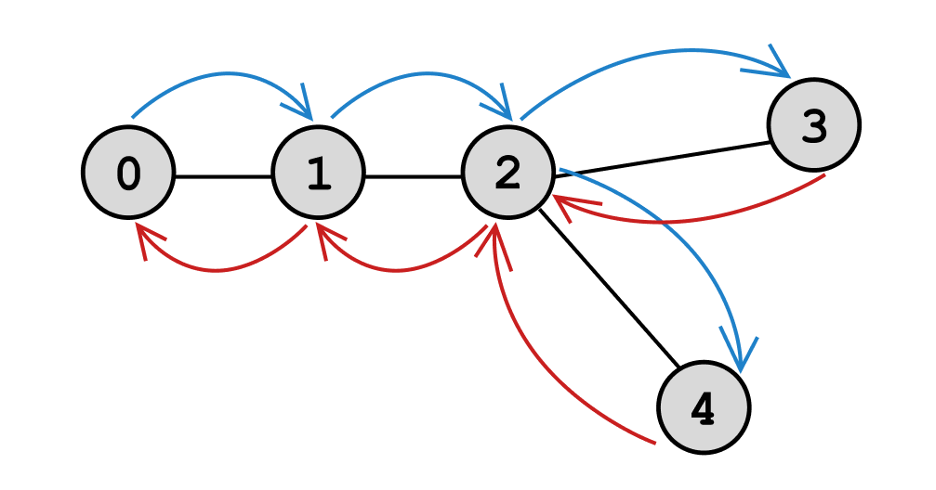

### [Алгоритмы](README.md) / Графы: Поиск в глубину

# **Поиск в глубину**

*Поиск в глубину* (DFS: Depth-First Search) это алгоритм обхода графа, который хочет как можно "глубже" уйти в граф.

(синие стрелки – вглубь графа, красные – обратно)

Алгоритм описывается рекурсивно. Если вершина не обработана, она обрабатывается и обрабатываются ее соседи. Если у вершины нет соседей, алгоритм переходит на уровень выше.

Сперва задаем граф в виде списка смежности.

    graph = [
        [1, 2],
        [0, 2, 3],
        [0, 1, 4],
        [1, 4],
        [2, 3, 5],
        [4, 6],
        [5]
    ]

Затем заводим множество обработанных вершин. Обратите внимание, что так как алгоритм работает рекурсивно, множество надо завести как глобальную переменную, чтобы оно каждый раз не обнулялось.

Приступим к написанию функции.

    used = set()

    def dfs(vert):
        print(vert)
        used.add(vert)
        for neib in graph[vert]:
            if neib not in used:
                dfs(neib)

Каждый раз, когда мы посещаем вершину мы ее сперва обрабатываем, добавляем во множество обработанных. Потом проходимся по соседям. Если сосед не найден во множестве обработанных, то алгоритм проделывается на нем. Если у вершины нет соседей или они все обработаны, то функция завершается.
