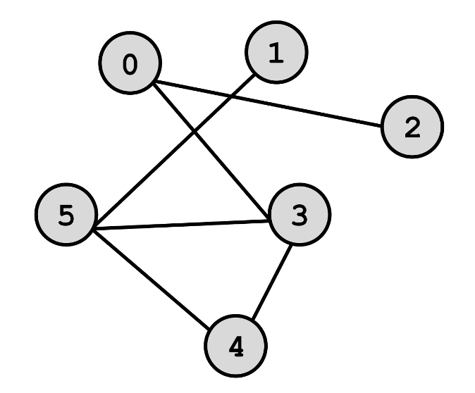

### [Алгоритмы](README.md) / Графы

# **Графы**

*Графы* – это математическая абстракция, которая отображает наличие связей между какими-либо объектами. Обычно граф изображается следующим образом:

Граф состоит из *вершин* (на рисунке – кружки) и *связей* между ними – ребер (линии между кружками). При этом то, как изображен граф не важно, так как ключевую роль играют только вершины и связи. 

Графы применяются везде, где есть связи между объектами: авиаперелеты, социальные сети, логистические решения служб доставки и прочее.

## **Способы хранения графа**

### **Матрица смежности**

Это таблица, где строки и столбцы принадлежат вершинам. В ячейке *(i, j)* ставится 1, если между вершинами *i* и *j* существует связь, и 0 в противном случае.

Граф с картинки ниже в виде матрицы смежности можно представить следующим образом:

    0 0 1 1 0 0
    0 0 0 0 0 1
    1 0 0 0 0 0
    1 0 0 0 1 1
    0 0 0 1 0 1
    0 1 0 1 1 0

Мы видим, что вершина 0 связана с вершиной 2 и 3, вершина 1 только с вершиной 5.

Матрица смежности удобна для хранения плотных графов (где количество ребер приближено к количеству вершин), потому что иначе мы видим много ячеек с нулями, которые не несут смысловой нагрузки, но занимают место.

### **Список смежности**

Список смежности представляет собой список списков, где в *i*-том списке описаны вершины, с которыми связана *i*-тая вершина. Граф из примера списком смежности можно описать следующим образом:

    graph = [
        [2, 3]
        [5]
        [0]
        [0, 4, 5]
        [3, 5]
        [1, 3, 4]
    ]

Список смежности подходит для хранения разреженных (тех графов, где мало ребер) графов, так как в списках указываются лишь вершины, с которыми связана данная вершина, при это отсутствие связи не записывается, что экономит память. СЛедует также отметить, что подобный тип хранения часто используется в различных алгоритмах на графах.

