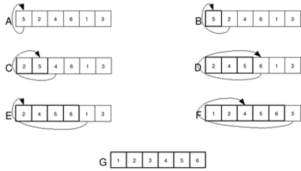

<script type="text/javascript" id="MathJax-script" async
  src="https://cdn.jsdelivr.net/npm/mathjax@3/es5/tex-mml-chtml.js">
</script>

<script>
  MathJax = {
    tex: {
      inlineMath: [['$', '$']]
    }
  };
</script>

# **Сортировка вставками**

Сортировка вставками, в отличие от сортировки пузырьком, не меняет соседние элементы местами при сравнении. Алгоритм идет по массиву и сортирует по ходу. Каждый следующий элемент он ставит в нужное место в отсортированной части массива.${N}$



Рассмотрим код:

```cpp
    void insertion_sort(vector<int> &A) {
        int N = A.size();

        for(int i = 1; i < N; ++i) {
            int key = A[i];
            int j = i - 1;
            while (j >= 0 && key < A[j]) {
                A[j+1] = A[j];
                --j;
            }
            A[j+1] = key;
        }
    }
```

Внешний цикл двигается по массиву, а внутренний переставляет элемент в уже отсортированную часть списка.

Каждую итерацию в переменную `key` запоминается сам элемент, который мы будем двигать на нужное место. Затем запускается цикл `while`, который будет повторяться до тех пор, пока `key` $< A_j$, т. е. элемента, стоящего перед `key`, и пока индекс $j$ неотрицательный. Если вдруг окажется, что элемент `key` $< A_j$, то цикл прервется и `key` вставится на нужное место. Если же такого элемента не найдется, значит, `key` – минимальный элемент из найденных и ставится в начало.

В наихудшем случае (когда массив отсортирован от большего к меньшему, т. е. в обратном порядке) внутренний и внешний цикл повторятся по $N$ раз и сложность работы алгоритма – $O(N^2)$. В следующем примере мы рассмотрим быструю сортировку – один из самых эффективных алгоритмов сортировки.
