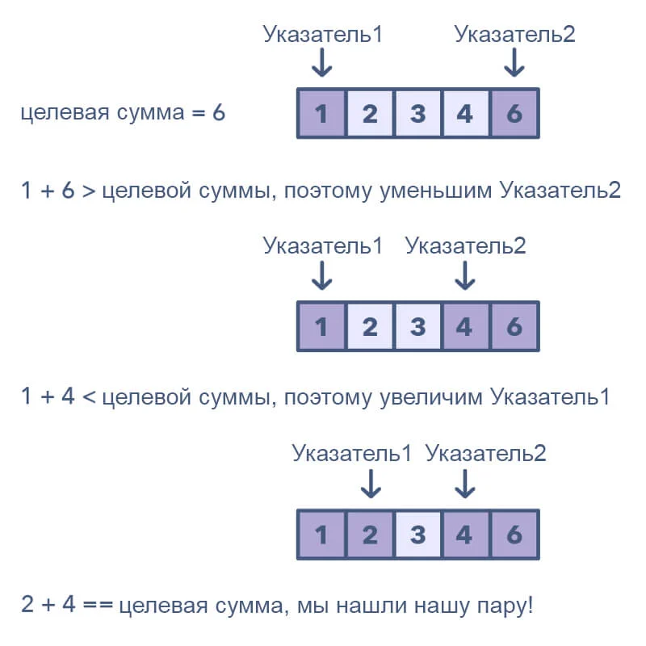

<script type="text/javascript" id="MathJax-script" async
  src="https://cdn.jsdelivr.net/npm/mathjax@3/es5/tex-mml-chtml.js">
</script>

<script>
  MathJax = {
    tex: {
      inlineMath: [['$', '$']]
    }
  };
</script>

### [Алгоритмы](index.md) / Метод двух указателей

# **Метод двух указателей**

*Метод двух указателей* помогает решать целый класс задач, в который в отсортированном массиве требуется найти два элемента, удовлетворяющие некоторому условию. Рассмотрим одну из них на примере: дан отсортированный массив $A$ и некоторое число $X$. Требуется найти такие индексы $i$ и $j$, что $A_i + A_j = X$.

## **Очевидное решение**

Несомненно, эту задачу можно решить простым перебором всех пар $i$ и $j$. Это делается вложенным циклом:

```py
def findPairs(array, x):
    # перебираем все возможные пары
    for i in range(len(array)):
        for j in range(len(array)):
            if array[i] + array[j] == x:
                return (i, j)
    return False # если таких пар нет, вернем False
```

Понятно, что асимптотика данного решения составляет $O(N^2)$. Но эту задачу можно решить линейно!

## **Линейное решение (метод двух указателей)**

Вспомним, что наш массив отсортирован, это важно. Тогда мы сперва выберем первый и последний элементы, на них будут распологаться наши "указатели". Если их сумма слишком велика, то мы уменьшим ее. Как? У нас отсортированный массив, значит можно сдвинуть правый указатель на один элемент влево, и он будет меньше, значит и сумма тоже будет меньше. Если сумма оказывается слишком мала, то мы поступаем ровно также: двигаем левый указатель на один элемент вправо, увеличивая сумму.



Тогда перепишем функцию:

```py
def findPairs(array, x):
    # правый и левый индексы – изначальное положение указателей
    right = len(array) - 1
    left = 0
    # двигаем указатели, пока правый и левый указатели не сойдуться
    while l < r:
        # если удовлетворяет условию
        if array[left] + array[right] == x:
            return (left, right)
        # если сумма меньше x
        elif array[left] + array[right] < x:
            # двигаем левый указатель на один элемент вправо
            left += 1
        # если больше
        else:
            # двигаем правый на один элемент влево
            right -= 1
    return False
```

В итоге, в худшем случае каждый элемент будет посещен единожды, и асимптотическая сложность такого решения – $O(N)$.
